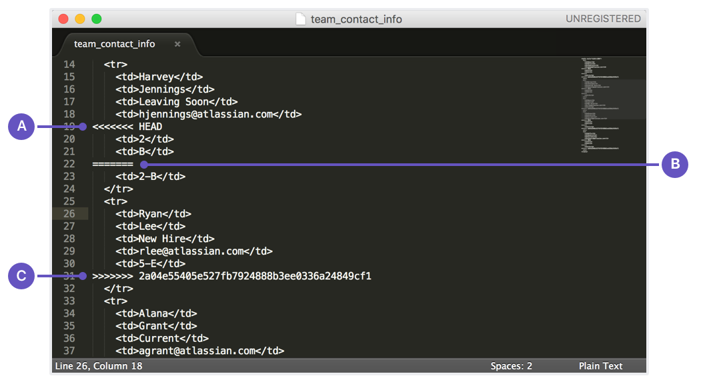
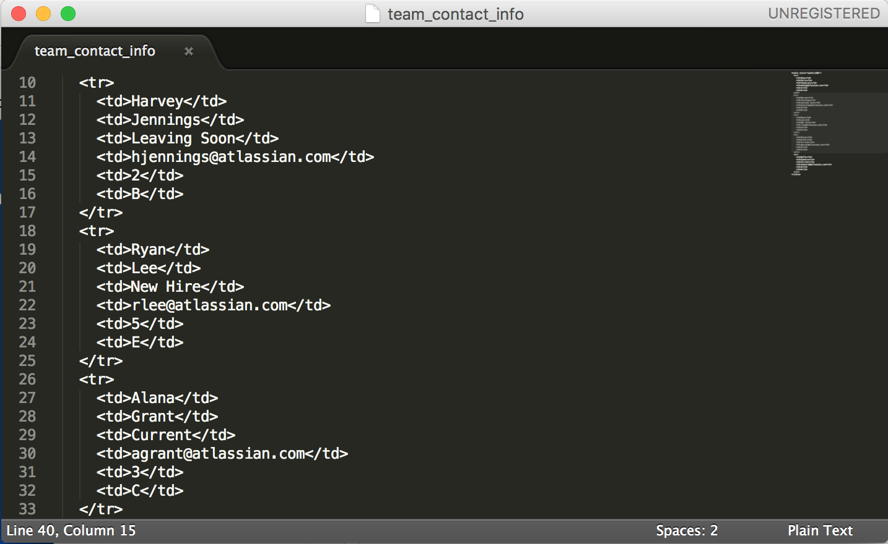

# 解决合并冲突
创建拉取请求时，Bitbucket会自动将源与您的更新进行比较，并将目标与原始代码进行比较。如果其他任何人将目的地更改为您触摸的相同代码，则当您尝试合并时，我们会通知您冲突。

发生合并冲突时，无法单击合并请求中的合并按钮。要解决这些冲突，您可以将更改拉到本地存储库并在那里进行修复。

### 解决Git分支之间的冲突
这些步骤包括解决Git存储库中两个分支之间冲突的详细信息。您将看到对这些占位符的引用：
- 分叉存储库的目录为 <repo_directory>
- 目标分支为 <destination_branch>
- 源分支为 <feature_branch>
- 解决冲突的文件为 <filename>

  
详细

  

  <ol>
  <li>确保您在存储库目录中。
    
    $ cd ~/<repo_directory>
   例如，如果您的存储库名称为my-repository，则结果可能看起来像这样：
 
    computer:$ cd ~/my-repository
    computer:my-repository emmap$
  </li>
  <li>从Bitbucket中提取存储库的最新版本。
  
    $ git pull
  </li>
  <li>签出源分支。
  
    $ git checkout <feature_branch>
  </li>
  <li>将目标分支拉入源分支。此时，拉动目的地将尝试将其与来源合并并显示所有冲突。
  
    $ git pull origin <destination_branch>
   例如，如果目标分支为master，则结果将如下所示：
   
    computer:my-repository emmap$ git pull origin master
    * branch            master     -> FETCH_HEAD
    Auto-merging team_contact_info.txt
    CONFLICT (content): Merge conflict in team_contact_info.txt
    Automatic merge failed; fix conflicts and then commit the result.
   当您在本地合并有冲突的两个分支时，打开编辑器时，文件中会出现冲突标记。
  </li>
  <li>打开文件以解决冲突。您可以使用命令行执行此操作，也可以导航到文件。  
   该文件将如下所示：
  
   
    
    $ git pull origin <destination_branch>
   **A**.  HEAD分支中更改的开始。在这种情况下，HEAD表示您要合并到其中的活动分支。
   
   **B**.  活动分支中更改的结束和非活动分支中更改的开始。
   
   **C**.  非活动分支中更改的结束。
  </li>
  <li>通过执行以下操作解决冲突：
   1.删除由Git添加的更改名称（ 上面的屏幕快照中的A，  B和  C）。
  
   2.更正内容。
   
   3.保存文件。
   
   结果将如下所示：
   
   
  </li>
  <li>添加并提交更改。
  
    $ git add <filename>
    $ git commit -m'commit message'
  </li>
    <li>将更改推送到遥控器。
  
    git push origin <feature_branch>
  </li>
  </ol>
  当您检查拉取请求时，拉取请求仍将处于打开状态，并且您将不再看到任何合并冲突。
  

